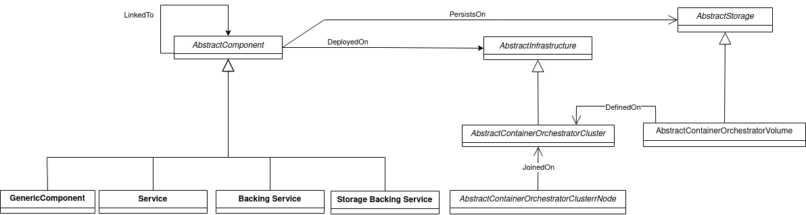
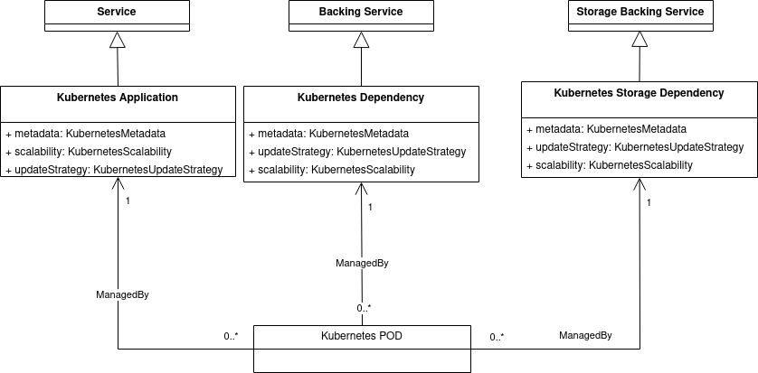
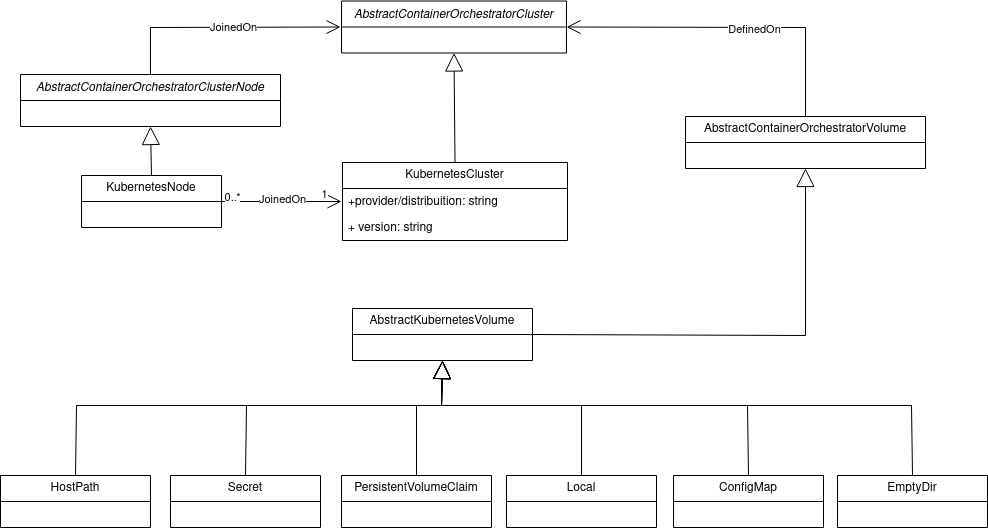
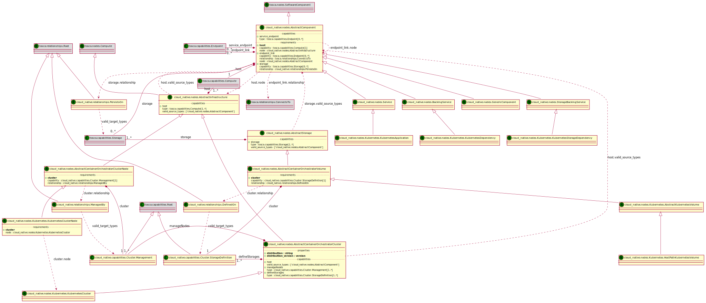
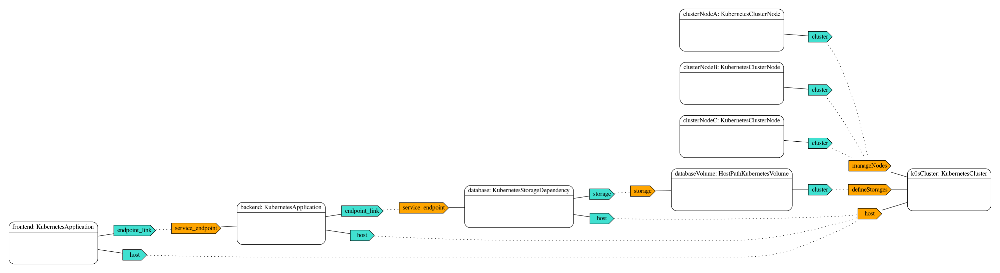
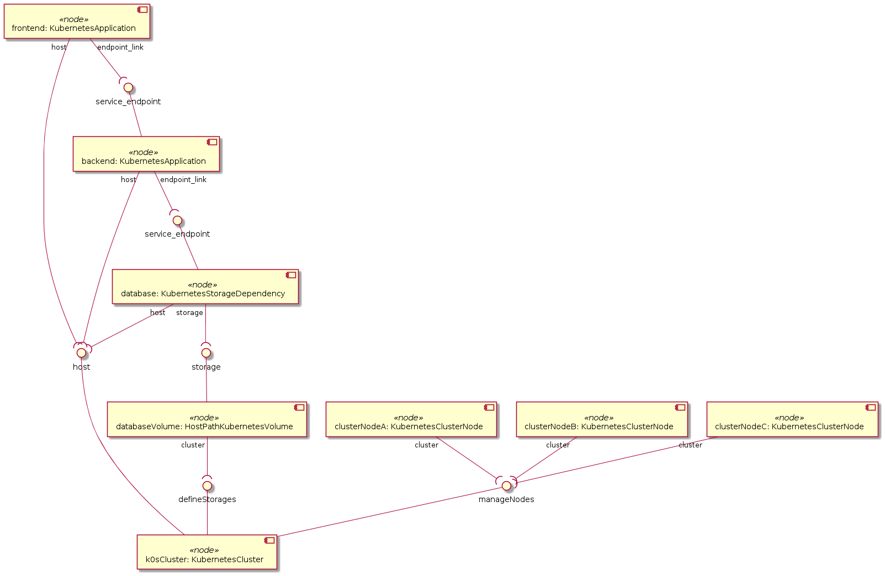
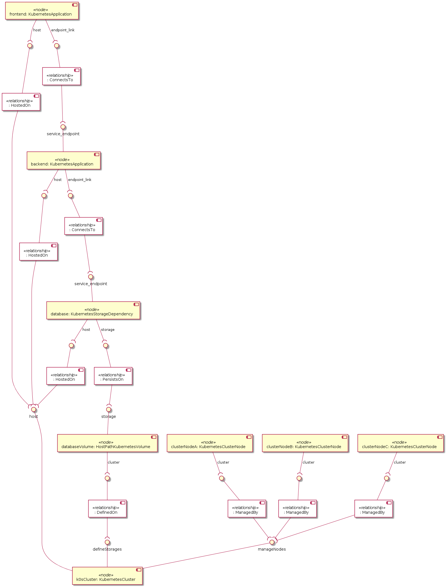
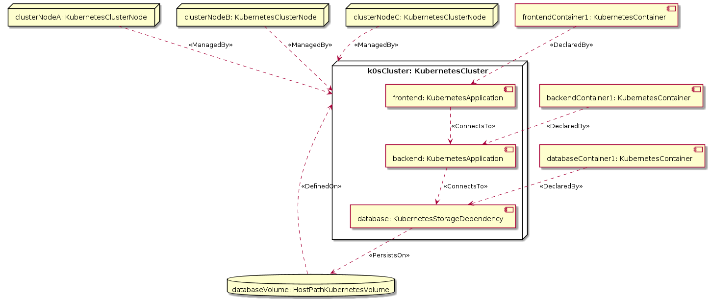
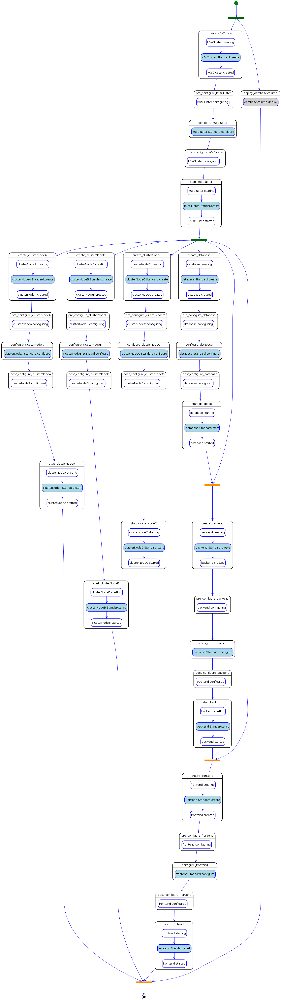

# Cloud-Native Applications Profile - Version 1.0.0

1. [Objective](#objective)
2. [Inspirations](#inspirations)
3. [Main elements](#main-elements)
   1. [Generic Node Types](#generic-node-types)
   2. [Kubernetes Specific Node Types](#kubernetes-specific-node-types)
4. [Cloud-Native Applications Profile definitions](#cloud-native-applications-profile-definitions)
   1. [Cloud-native application elements](#cloud-native-application-elements)
      1. [cloud_native.nodes.AbstractComponent](#cloud_nativenodesabstractcomponent)
      2. [cloud_native.nodes.Service](#cloud_nativenodesservice)
      3. [cloud_native.nodes.BackingService](#cloud_nativenodesbackingservice)
      4. [cloud_native.nodes.StorageBackingService](#cloud_nativenodesstoragebackingservice)
      5. [cloud_native.nodes.Kubernetes.KubernetesApplication](#cloud_nativenodeskuberneteskubernetesapplication)
      6. [cloud_native.nodes.Kubernetes.KubernetesDependency](#cloud_nativenodeskuberneteskubernetesdependency)
      7. [cloud_native.nodes.Kubernetes.KubernetesDependency](#cloud_nativenodeskuberneteskubernetesdependency-1)
      8. [cloud_native.nodes.Kubernetes.KubernetesDependency](#cloud_nativenodeskuberneteskubernetesdependency-2)
   2. [Compute infrastructure elements](#compute-infrastructure-elements)
      1. [cloud_native.nodes.AbstractInfrastructure](#cloud_nativenodesabstractinfrastructure)
      2. [cloud_native.nodes.AbstractContainerOrchestratorCluster](#cloud_nativenodesabstractcontainerorchestratorcluster)
      3. [cloud_native.nodes.AbstractContainerOrchestratorClusterNode](#cloud_nativenodesabstractcontainerorchestratorclusternode)
      4. [cloud_native.nodes.kubernetes.KubernetesCluster](#cloud_nativenodeskuberneteskubernetescluster)
      5. [cloud_native.nodes.Kubernetes.KubernetesClusterNode](#cloud_nativenodeskuberneteskubernetesclusternode)
   3. [Storage elements](#storage-elements)
      1. [cloud_native.nodes.AbstractStorage](#cloud_nativenodesabstractstorage)
      2. [cloud_native.nodes.AbstractContainerOrchestratorVolume](#cloud_nativenodesabstractcontainerorchestratorvolume)
      3. [cloud_native.nodes.Kubernetes.AbstractKubernetesVolume](#cloud_nativenodeskubernetesabstractkubernetesvolume)
      4. [cloud_native.nodes.Kubernetes.HostPathKubernetesVolume](#cloud_nativenodeskuberneteshostpathkubernetesvolume)
      5. [cloud_native.nodes.Kubernetes.SecretKubernetesVolume](#cloud_nativenodeskubernetessecretkubernetesvolume)
      6. [cloud_native.nodes.Kubernetes.PersistentVolumeClaimKubernetesVolume](#cloud_nativenodeskubernetespersistentvolumeclaimkubernetesvolume)
      7. [cloud_native.nodes.Kubernetes.LocalKubernetesVolume](#cloud_nativenodeskuberneteslocalkubernetesvolume)
      8. [cloud_native.nodes.Kubernetes.ConfigMapKubernetesVolume](#cloud_nativenodeskubernetesconfigmapkubernetesvolume)
      9. [cloud_native.nodes.Kubernetes.EmptyDirKubernetesVolume](#cloud_nativenodeskubernetesemptydirkubernetesvolume)
5. [Cloud-native TOSCA profile file](#cloud-native-tosca-profile-file)
6. [Complete Class Diagram](#complete-class-diagram)
7. [Using the Cloud-native TOSCA Template to model an application topology](#using-the-cloud-native-tosca-template-to-model-an-application-topology)

## Objective

This profile empowers users to model cloud-native applications with TOSCA, tailoring solutions for various contexts, including clusterized applications. Because of TOSCA's extensibility, users can adapt its use to different cloud container orchestrators, such as Kubernetes, Nomad, or any other of their choice.

## Inspirations

We designed the profile following the ideas presented in the paper ["An Evaluation of Modeling Options for Cloud-native Application Architectures to Enable Quality Investigations"](https://ieeexplore.ieee.org/document/10061800/), which allows for evaluating software architectures of cloud-native applications according to quality aspects.
However, we did not strictly follow the TOSCA extension proposed in that paper since we could use the TOSCA Simple Profile better. We also needed to extend that work, adapting it to the clusterized applications universe and focusing on cloud architecture.

The paper mentioned earlier presents an interesting cloud-native architecture quality model formulated based on the [Quamoco Quality meta-model](https://ieeexplore.ieee.org/document/6227106/). The authors propose entities for modeling cloud-native applications.

## Main elements

This section summarizes the node types defined in this template and their functions. The following subsections define, respectively , [generic node types](#generic-node-types), i.e., technology-independent ones, and [Kubernetes-specific node types](#kubernetes-specific-node-types) that show templates' extensibility concerning cloud container orchestrators.

### Generic Node Types

The following table presents only generic node types (independent of technology):

| Type                              | Name                                         | Description                                                                             | Relationship                                        |
| --------------------------------- | -------------------------------------------- | --------------------------------------------------------------------------------------- | --------------------------------------------------- |
| Cloud-native application elements | Abstract Component                           | An abstract element of the cloud-native application.                                    | Part of the application                             |
|                                   | Service                                      | Implements a business feature.                                                          | Derived from AbstractComponent                      |
|                                   | Backing Service                              | Implements common functionalities used by the services.                                 | Derived from AbstractComponent                      |
|                                   | Data Backing Service Storage                 | Data from other services.                                                               | Derived from AbstractComponent                      |
|                                   | Generic Component                            | Represents a component that can not be mapped to any other service kind                 | Derived from AbstractComponent                      |
| Compute infrastructure elements   | Abstract Compute Infrastructure              | Infrastructure used to execute the application and its dependencies (backing services). | Part of the application infrastructure              |
|                                   | Abstract Container Orchestrator Cluster      | A cluster managed by a Container Orchestrator like Kubernetes or Nomad.                 | Derived from Abstract Compute Infrastructure        |
|                                   | Abstract Container Orchestrator Cluster Node | A cluster node managed by a Container Orchestrator like Kubernetes or Nomad.            | Can join an Abstract Container Orchestrator Cluster |
| Storage elements                  | Abstract Storage                             | Stores data used by the native-cloud application elements.                              | Part of the storage                                 |
|                                   | Abstract Container Orchestrator Volume       | Implements the concept of a volume defined on the cluster.                              | Derived from Abstract Storage                       |

In the following Figure, we can see all these types and how they relate. In this class diagram, classes represent node types, inheritances
represent derivations of the node type, and associations represent relationship between node types (requirements from the source node type fulfilled by capabilities of the target node type).



### Kubernetes Specific Node Types

| Type                              | Name                          | Description                                                                                                     | Relationship                                        |
| --------------------------------- | ----------------------------- | --------------------------------------------------------------------------------------------------------------- | --------------------------------------------------- |
| Cloud-native application elements | Kubernetes Application        | A Kubernetes deployable application that implements business features.                                          | Derived from Service                                |
|                                   | Kubernetes Dependency         | A Kubernetes deployable application that implements common functionalities used by the Kubernetes Applications. | Derived from Backing Service                        |
|                                   | Kubernetes Storage Dependency | A Kubernetes deployable application that stores data from other components.                                     | Derived from Storage Backing Service                |
|                                   | Kubernetes POD                | A Kubernetes POD.                                                                                               |                                                     |
| Compute infrastructure elements   | Kubernetes Cluster            | Kubernetes cluster managed by an specific Kubernete distribution like K0s, K3s, RKE2, MicroK8s, among other.    | Derived from AbstractContainerOrchestratorCluster   |
|                                   | Kubernetes Node               | Physical or virtual machines that joined a Kubernetes cluster.                                                  | Joined on AbstractContainerOrchestratorCluster      |
| Storage elements                  | Abstract Kubernetes Volume    | Any kind of Kubernetes defined volume.                                                                          | Derived from Abstract Container Orchestrator Volume |

In the following Figure, for the sake of simplicity, we focus on Kubernetes-specific application element and how they relate. It is important to observe that attributes represent TOSCA properties, and attribute classes represent TOSCA Data Types, and according to TOSCA, all relationships of the parent node types are still valid to derived node types, and those relationships can be refined.



In the next Figure, we focus on Kubernetes-specific compute infrastructure and storage elements.



## Cloud-Native Applications Profile definitions

This section is normative and describes the properties, atributes, and definitions for all TOSCA node types defined for the Cloud-Native Applications Profile Version 1.0.0 specification, which are needed to describe a TOSCA Service template (in YAML).

### Cloud-native application elements

#### cloud_native.nodes.AbstractComponent

The Cloud-native Abstract Component Node Type is the default type that all other Cloud Native Application Node Types derive from. This node sets requirements, capabitilities and properties that derived Node Types must provide, in a consistent way.

##### Properties

| Name              | Required | Type                                             | Constraints | Description                                                                                                        |
| ----------------- | -------- | ------------------------------------------------ | ----------- | ------------------------------------------------------------------------------------------------------------------ |
| component_version | no       | tosca:version                                    | None        | The optional software component’s version. _Inherited from parent types._                                          |
| admin_credential  | no       | tosca.datatypes.Credential                       | None        | The optional credential that can be used to authenticate to the software component. _Inherited from parent types._ |
| metadata          | yes      | cloud_native.datatypes.AbstractComponentMetadata | None        | Metadata of the application, for instance name, development team, version, description.                            |

| finops | yes | cloud_native.datatypes.FinOpsTags | None | Tags used to implement FinOps, such as environment, project, team, owner and cost center. |
| scalability | false | cloud_native.datatypes.AbstractComponentScalability | None | Sets the mininum, maximum and default number of instances of the node. |
| updateStrategy | yes | cloud_native.datatypes.AbstractComponentUpdateStrategy | None | Strategy used to update the application. |

##### Attributes

| Name       | Required | Type   | Constraints      | Description                                                                                                                                                                                                                                                                                                                                                   |
| ---------- | -------- | ------ | ---------------- | ------------------------------------------------------------------------------------------------------------------------------------------------------------------------------------------------------------------------------------------------------------------------------------------------------------------------------------------------------------- |
| tosca_id   | yes      | string | None             | A unique identifier of the realized instance of a Node Template that derives from any TOSCA normative type. _Inherited from parent types._                                                                                                                                                                                                                    |
| tosca_name | yes      | string | None             | This attribute reflects the name of the Node Template as defined in the TOSCA service template. This name is not unique to the realized instance model of the corresponding deployed application as each template in the model can result in one or more instances (e.g., scaled) when orchestrated to a provider environment. _Inherited from parent types._ |
| state      | yes      | string | default: initial | The state of the node instance. Allowed values: initial, creating, created, configuring, configured, starting, started, stopping, deleting, error. _Inherited from parent types._                                                                                                                                                                             |

##### Definition

```yaml
cloud_native.nodes.AbstractComponent:
  description: An abstract element of the cloud-native application.
  derived_from: tosca.nodes.SoftwareComponent
  properties:
    scalability:
      type: cloud_native.datatypes.Scalability
      required: false
    finops:
      type: cloud_native.datatypes.FinOpsTags
      required: true
  requirements:
    - host:
        description: Infrastructure needed to deploy the component
        capability: tosca.capabilities.Compute
        # TOSCA v2.0 - count_range: [1, 1]
        occurrences: [1, 1]
        node: cloud_native.nodes.AbstractInfrastructure
    - endpoint_link:
        description: Allows the definition of links between Components
        capability: tosca.capabilities.Endpoint
        relationship: tosca.relationships.ConnectsTo
        node: cloud_native.nodes.AbstractComponent
        # TOSCA v2.0 - count_range: [0, UNBOUNDED]
        occurrences: [0, UNBOUNDED]
    - storage:
        description: Storage used by the component to persist data
        capability: tosca.capabilities.Storage
        relationship: cloud_native.relationships.PersistsOn
        # TOSCA v2.0 - count_range: [0, UNBOUNDED]
        occurrences: [0, UNBOUNDED]
  capabilities:
    service_endpoint:
      description: A layer 4 endpoint provided by the component.
      type: tosca.capabilities.Endpoint
      occurrences: [0, UNBOUNDED]
```

[TOSCA YAML](nodes/abstract_component.yaml)

#### cloud_native.nodes.Service

The Cloud-native Abstract Component Node Type is the default type that all other Cloud Native Application Node Types derive from. This node sets requirements, capabitilities and properties that derived Node Types must provide, in a consistent way.

##### Properties

Same from [cloud_native.nodes.AbstractComponent](#cloud_nativenodesabstractcomponent).

##### Attributes

Same from [cloud_native.nodes.AbstractComponent](#cloud_nativenodesabstractcomponent).

##### Definition

```yaml
cloud_native.nodes.Service:
  description: A cloud-native service.
  derived_from: cloud_native.nodes.AbstractComponent
```

[TOSCA YAML](nodes/service.yaml)

#### cloud_native.nodes.BackingService

Services that implement common functionalities used by the services, such as a log aggregator or a business process engine.

##### Properties

Same from [cloud_native.nodes.AbstractComponent](#cloud_nativenodesabstractcomponent).

##### Attributes

Same from [cloud_native.nodes.AbstractComponent](#cloud_nativenodesabstractcomponent).

##### Definition

```yaml
cloud_native.nodes.BackingService:
  description: A cloud-native backing service, such as a log aggregator or a business process engine.
  derived_from: cloud_native.nodes.AbstractComponent
```

[TOSCA YAML](nodes/backing_service.yaml)

#### cloud_native.nodes.StorageBackingService

Services that store data like a SQL database, e.g., PostgresSQL, a NoSQL database, e.g., Cassandra, or any other type of storage backing service.

##### Properties

Same from [cloud_native.nodes.AbstractComponent](#cloud_nativenodesabstractcomponent).

##### Attributes

Same from [cloud_native.nodes.AbstractComponent](#cloud_nativenodesabstractcomponent).

##### Definition

```yaml
cloud_native.nodes.StorageBackingService:
  description: A cloud-native storage backing service like a SQL database, e.g., PostgresSQL, a NoSQL database, e.g., Cassandra, or any other type of storage backing service.
  derived_from: cloud_native.nodes.AbstractComponent
```

[TOSCA YAML](nodes/storage_backing_service.yaml)

#### cloud_native.nodes.Kubernetes.KubernetesApplication

A Kubernetes deployable application that implements business features.

##### Properties

Same from [cloud_native.nodes.Service](#cloud_nativenodesservice).

##### Attributes

Same from [cloud_native.nodes.Service](#cloud_nativenodesservice).

##### Definition

```yaml
cloud_native.nodes.Kubernetes.KubernetesApplication:
  description: A Kubernetes deployable application that implements business features.
  derived_from: cloud_native.nodes.Service
```

[TOSCA YAML](nodes/kubernetes/kubernetes_application.yaml)

#### cloud_native.nodes.Kubernetes.KubernetesDependency

A Kubernetes deployable application that implements common functionalities used by the Kubernetes Applications.

##### Properties

Same from [cloud_native.nodes.BackingService](#cloud_nativenodesbackingservice).

##### Attributes

Same from [cloud_native.nodes.BackingService](#cloud_nativenodesbackingservice).

##### Definition

```yaml
cloud_native.nodes.Kubernetes.KubernetesDependency:
  description: A Kubernetes deployable application that implements common functionalities used by the Kubernetes Applications.
  derived_from: cloud_native.nodes.BackingService
```

[TOSCA YAML](nodes/kubernetes/kubernetes_dependency.yaml)

#### cloud_native.nodes.Kubernetes.KubernetesDependency

A Kubernetes deployable application that implements common functionalities used by the Kubernetes Applications.

##### Properties

Same from [cloud_native.nodes.StorageBackingService](#cloud_nativenodesstoragebackingservice).

##### Attributes

Same from [cloud_native.nodes.StorageBackingService](#cloud_nativenodesstoragebackingservice).

##### Definition

```yaml
cloud_native.nodes.Kubernetes.KubernetesStorageDependency:
  description: A Kubernetes deployable application that implements common functionalities used by the Kubernetes Applications.
  derived_from: cloud_native.nodes.StorageBackingService
```

[TOSCA YAML](nodes/kubernetes/kubernetes_dependency.yaml)

#### cloud_native.nodes.Kubernetes.KubernetesDependency

A Kubernetes deployable application that implements common functionalities used by the Kubernetes Applications.

##### Properties

Same from [cloud_native.nodes.StorageBackingService](#cloud_nativenodesstoragebackingservice).

##### Attributes

Same from [cloud_native.nodes.StorageBackingService](#cloud_nativenodesstoragebackingservice).

##### Definition

```yaml
cloud_native.nodes.Kubernetes.KubernetesStorageDependency:
  description: A Kubernetes deployable application that implements common functionalities used by the Kubernetes Applications.
  derived_from: cloud_native.nodes.StorageBackingService
```

[TOSCA YAML](nodes/kubernetes/kubernetes_dependency.yaml)

### Compute infrastructure elements

#### cloud_native.nodes.AbstractInfrastructure

The Cloud-native Abstract Infrastructure Node Type is the default type from which all other Cloud Native Infrastructure Node Types derive. This node consistently sets the requirements, capabitilities and properties that derived Node Types must provide.

##### Properties

| Name | Required | Type | Constraints | Description |
| ---- | -------- | ---- | ----------- | ----------- |
| N/A  | N/A      | N/A  | N/A         | N/A         |

##### Attributes

| Name            | Required | Type               | Constraints | Description                                                                                                                                        |
| --------------- | -------- | ------------------ | ----------- | -------------------------------------------------------------------------------------------------------------------------------------------------- |
| private_address | no       | string             | None        | The primary private IP address assigned by the cloud provider that applications may use to access the Compute node. _Inherited from parent types._ |
| public_address  | no       | string             | None        | The primary public IP address assigned by the cloud provider that applications may use to access the Compute node. _Inherited from parent types._  |
| networks        | no       | map of NetworkInfo | None        | The map of logical networks assigned to the compute host instance and information about them. _Inherited from parent types._                       |
| ports           | no       | map of PortInfo    | None        | The map of logical ports assigned to the compute host instance and information about them. _Inherited from parent types._                          |

##### Definition

```yaml
cloud_native.nodes.AbstractInfrastructure:
  description: An abstract element of the cloud-native application.
  derived_from: tosca.nodes.Compute
```

[TOSCA YAML](nodes/abstract_infrastructure.yaml)

#### cloud_native.nodes.AbstractContainerOrchestratorCluster

A cluster managed by a Container Orchestrator like Kubernetes or Nomad.

##### Properties

| Name                   | Required | Type    | Constraints | Description                                                                           |
| ---------------------- | -------- | ------- | ----------- | ------------------------------------------------------------------------------------- |
| distribuituion         | yes      | string  | N/A         | Name of the Container Orchestrator Cluster distribution used to create the cluster    |
| distribuituion_version | yes      | version | N/A         | Version of the Container Orchestrator Cluster distribution used to create the cluster |

##### Attributes

Same from [cloud_native.nodes.AbstractInfrastructure](#cloud_nativenodesabstractinfrastructure).

##### Definition

```yaml
cloud_native.nodes.AbstractContainerOrchestratorCluster:
  description: A cluster managed by a Container Orchestrator like Kubernetes or Nomad.
  derived_from: cloud_native.nodes.AbstractInfrastructure
  properties:
    distribution:
      type: string
      required: true
    distribution_version:
      type: version
      required: true
```

[TOSCA YAML](nodes/abstract_container_orchestrator_cluster.yaml)

#### cloud_native.nodes.AbstractContainerOrchestratorClusterNode

A cluster node managed by a Container Orchestrator like Kubernetes or Nomad.

##### Properties

| Name                   | Required | Type    | Constraints | Description                                                                           |
| ---------------------- | -------- | ------- | ----------- | ------------------------------------------------------------------------------------- |
| distribuituion         | yes      | string  | N/A         | Name of the Container Orchestrator Cluster distribution used to create the cluster    |
| distribuituion_version | yes      | version | N/A         | Version of the Container Orchestrator Cluster distribution used to create the cluster |

##### Attributes

Same from [cloud_native.nodes.AbstractInfrastructure](#cloud_nativenodesabstractinfrastructure).

##### Definition

```yaml
cloud_native.nodes.AbstractContainerOrchestratorClusterNode:
  derived_from: cloud_native.nodes.AbstractInfrastructure
  description: A cluster node managed by a Container Orchestrator like Kubernetes or Nomad.
  requirements:
    - cluster:
        description: The cluster there the node is joined
        capability: cloud_native.capabilities.Cluster.Management
        relationship: cloud_native.relationships.ManagedBy
```

[TOSCA YAML](nodes/abstract_container_orchestrator_cluster_node.yaml)

#### cloud_native.nodes.kubernetes.KubernetesCluster

Kubernetes cluster managed by a specific Kubernete distribution like K0s, K3s, RKE2, MicroK8s, among others.

##### Properties

Same from [cloud_native.nodes.AbstractContainerOrchestratorCluster](#cloud_nativenodesabstractinfrastructure).

##### Attributes

Same from [cloud_native.nodes.AbstractContainerOrchestratorCluster](#cloud_nativenodesabstractinfrastructure).

##### Definition

```yaml
cloud_native.nodes.Kubernetes.KubernetesCluster:
  description: Kubernetes cluster managed by a specific Kubernete distribution like K0s, K3s, RKE2, MicroK8s, among others.
  derived_from: cloud_native.nodes.AbstractContainerOrchestratorCluster
```

[TOSCA YAML](nodes/kubernetes/kubernetes_cluster.yaml)

#### cloud_native.nodes.Kubernetes.KubernetesClusterNode

Kubernetes cluster managed by an specific Kubernete distribution like K0s, K3s, RKE2, MicroK8s, among others.

##### Properties

Same from [cloud_native.nodes.AbstractContainerOrchestratorClusterNode](#cloud_nativenodesabstractinfrastructure).

##### Attributes

Same from [cloud_native.nodes.AbstractContainerOrchestratorClusterNode](#cloud_nativenodesabstractcontainerorchestratorclusternode).

##### Definition

```yaml
cloud_native.nodes.Kubernetes.KubernetesClusterNode:
  description: Physical or virtual machines that joined a Kubernetes cluster.
  derived_from: cloud_native.nodes.AbstractContainerOrchestratorClusterNode
  requirements:
    - cluster:
        node: cloud_native.nodes.Kubernetes.KubernetesCluster
        description: Cluster that the node is joined
```

[TOSCA YAML](nodes/kubernetes/kubernetes_cluster_node.yaml)

### Storage elements

#### cloud_native.nodes.AbstractStorage

Stores data.

##### Properties

| Name | Required | Type             | Constraints            | Description                                                                                       |
| ---- | -------- | ---------------- | ---------------------- | ------------------------------------------------------------------------------------------------- |
| name | yes      | string           | None                   | The logical name (or ID) of the storage resource. \__Inherited from parent types._                |
| size | no       | scalar-unit.size | greater_or_equal: 0 MB | The requested initial storage size (default unit is in Gigabytes). _Inherited from parent types._ |

##### Attributes

| Name       | Required | Type   | Constraints      | Description                                                                                                                                                                                                                                                                                                                                                   |
| ---------- | -------- | ------ | ---------------- | ------------------------------------------------------------------------------------------------------------------------------------------------------------------------------------------------------------------------------------------------------------------------------------------------------------------------------------------------------------- |
| tosca_id   | yes      | string | None             | A unique identifier of the realized instance of a Node Template that derives from any TOSCA normative type. _Inherited from parent types._                                                                                                                                                                                                                    |
| tosca_name | yes      | string | None             | This attribute reflects the name of the Node Template as defined in the TOSCA service template. This name is not unique to the realized instance model of the corresponding deployed application as each template in the model can result in one or more instances (e.g., scaled) when orchestrated to a provider environment. _Inherited from parent types._ |
| state      | yes      | string | default: initial | The state of the node instance. Allowed values: initial, creating, created, configuring, configured, starting, started, stopping, deleting, error. _Inherited from parent types._                                                                                                                                                                             |

##### Definition

```yaml
cloud_native.nodes.AbstractStorage:
  description: Stores data.
  derived_from: tosca.nodes.Abstract.Storage
  capabilities:
    storage:
      type: tosca.capabilities.Storage
      valid_source_types: [cloud_native.nodes.AbstractComponent]
```

[TOSCA YAML](nodes/abstract_storage.yaml)

#### cloud_native.nodes.AbstractContainerOrchestratorVolume

Stores data of components running in a container orchestrator cluster.

##### Properties

Same from [cloud_native.nodes.AbstractStorage](#cloud_nativenodesabstractstorage).

##### Attributes

Same from [cloud_native.nodes.AbstractStorage](#cloud_nativenodesabstractstorage).

##### Definition

```yaml
cloud_native.nodes.AbstractContainerOrchestratorVolume:
  description: Stores data of components running in a container orchestrator cluster.
  derived_from: cloud_native.nodes.AbstractStorage
  requirements:
    - cluster:
        description: Cluster where the storage is defined
        relationship: cloud_native.relationships.DefinedOn
        capability: cloud_native.capabilities.Cluster.StorageDefinition
```

[TOSCA YAML](nodes/abstract_storage.yaml)

#### cloud_native.nodes.Kubernetes.AbstractKubernetesVolume

Stores data of components running in a container orchestrator cluster.

##### Properties

Same from [cloud_native.nodes.AbstractContainerOrchestratorVolume](#cloud_nativenodesabstractcontainerorchestratorvolume).

##### Attributes

Same from [cloud_native.nodes.AbstractContainerOrchestratorVolume](#cloud_nativenodesabstractcontainerorchestratorvolume).

##### Definition

```yaml
cloud_native.nodes.Kubernetes.AbstractKubernetesVolume:
  description: Any kind of Kubernetes defined volume.
  derived_from: cloud_native.nodes.AbstractContainerOrchestratorVolume
```

[TOSCA YAML](nodes/kubernetes/abstract_kubernetes_volume.yaml)

#### cloud_native.nodes.Kubernetes.HostPathKubernetesVolume

A volume that is mapped in the HostPath.

##### Properties

All the properties from [cloud_native.nodes.Kubernetes.AbstractKubernetesVolume](#cloud_nativenodeskubernetesabstractkubernetesvolume) and these:

| Name | Required | Type   | Constraints                                                                                            | Description                      |
| ---- | -------- | ------ | ------------------------------------------------------------------------------------------------------ | -------------------------------- |
| path | yes      | string | None                                                                                                   | The volume location on the host. |
| type | no       | string | valid_values: ["", DirectoryOrCreate, Directory, FileOrCreate, File, Socket, CharDevice, BlockDevice ] | Volume type.                     |

##### Attributes

Same from [cloud_native.nodes.Kubernetes.AbstractKubernetesVolume](#cloud_nativenodeskubernetesabstractkubernetesvolume).

##### Definition

```yaml
cloud_native.nodes.Kubernetes.HostPathKubernetesVolume:
  description: A volume that is mapped in the HostPath.
  properties:
    path:
      description: The volume location on host
      type: string
      required: true

    type:
      description: 'Volume type. Can be one of: ‌ "", DirectoryOrCreate, Directory, FileOrCreate, File, Socket, CharDevice, BlockDevice'
      type: string
      required: false
      default: Directory
      constraints:
        - valid_values:
            [
              "",
              DirectoryOrCreate,
              Directory,
              FileOrCreate,
              File,
              Socket,
              CharDevice,
              BlockDevice,
            ]
  derived_from: cloud_native.nodes.Kubernetes.AbstractKubernetesVolume
```

[TOSCA YAML](nodes/kubernetes/host_path_kubernetes_volume.yaml)

#### cloud_native.nodes.Kubernetes.SecretKubernetesVolume

A volume that is mapped from a secret.

##### Properties

Same from [cloud_native.nodes.Kubernetes.AbstractKubernetesVolume](#cloud_nativenodeskubernetesabstractkubernetesvolume).

##### Attributes

Same from [cloud_native.nodes.Kubernetes.AbstractKubernetesVolume](#cloud_nativenodeskubernetesabstractkubernetesvolume).

##### Definition

```yaml
cloud_native.nodes.Kubernetes.SecretKubernetesVolume:
  description: A volume that is mapped from a secret.
  derived_from: cloud_native.nodes.Kubernetes.AbstractKubernetesVolume
```

[TOSCA YAML](nodes/kubernetes/secret_kubernetes_volume.yaml)

#### cloud_native.nodes.Kubernetes.PersistentVolumeClaimKubernetesVolume

A volume that is mapped from a persistent volume claim.

##### Properties

Same from [cloud_native.nodes.Kubernetes.AbstractKubernetesVolume](#cloud_nativenodeskubernetesabstractkubernetesvolume).

##### Attributes

Same from [cloud_native.nodes.Kubernetes.AbstractKubernetesVolume](#cloud_nativenodeskubernetesabstractkubernetesvolume).

##### Definition

```yaml
cloud_native.nodes.Kubernetes.PersistentVolumeClaimKubernetesVolume:
  description: A volume that is mapped from a persistent volume claim.
  derived_from: cloud_native.nodes.Kubernetes.AbstractKubernetesVolume
```

[TOSCA YAML](nodes/kubernetes/persistent_volume_claim_kubernetes_volume.yaml)

#### cloud_native.nodes.Kubernetes.LocalKubernetesVolume

A volume that is mapped from a persistent volume claim.

##### Properties

Same from [cloud_native.nodes.Kubernetes.AbstractKubernetesVolume](#cloud_nativenodeskubernetesabstractkubernetesvolume).

##### Attributes

Same from [cloud_native.nodes.Kubernetes.AbstractKubernetesVolume](#cloud_nativenodeskubernetesabstractkubernetesvolume).

##### Definition

```yaml
cloud_native.nodes.Kubernetes.LocalKubernetesVolume:
  description: A volume that is mounted local storage device such as a disk, partition, or directory.
  derived_from: cloud_native.nodes.Kubernetes.AbstractKubernetesVolume
```

[TOSCA YAML](nodes/kubernetes/local_kubernetes_volume.yaml)

#### cloud_native.nodes.Kubernetes.ConfigMapKubernetesVolume

A volume that is mounted from a config map.

##### Properties

Same from [cloud_native.nodes.Kubernetes.AbstractKubernetesVolume](#cloud_nativenodeskubernetesabstractkubernetesvolume).

##### Attributes

Same from [cloud_native.nodes.Kubernetes.AbstractKubernetesVolume](#cloud_nativenodeskubernetesabstractkubernetesvolume).

##### Definition

```yaml
cloud_native.nodes.Kubernetes.ConfigMapKubernetesVolume:
  description: A volume that is mounted from a config map.
  derived_from: cloud_native.nodes.Kubernetes.AbstractKubernetesVolume
```

[TOSCA YAML](nodes/kubernetes/config_map_kubernetes_volume.yaml)

#### cloud_native.nodes.Kubernetes.EmptyDirKubernetesVolume

A volume created when a Kubernetes Pod is assigned to a node, and it is initially empty.

##### Properties

Same from [cloud_native.nodes.Kubernetes.AbstractKubernetesVolume](#cloud_nativenodeskubernetesabstractkubernetesvolume).

##### Attributes

Same from [cloud_native.nodes.Kubernetes.AbstractKubernetesVolume](#cloud_nativenodeskubernetesabstractkubernetesvolume).

##### Definition

```yaml
cloud_native.nodes.Kubernetes.EmptyDirKubernetesVolume:
  description: A volume created when a Kubernetes Pod is assigned to a node, and it is initially empty.
  derived_from: cloud_native.nodes.Kubernetes.AbstractKubernetesVolume
```

[TOSCA YAML](nodes/kubernetes/empty_dir_kubernetes_volume.yaml)

## Cloud-native TOSCA profile file

This is the [complete cloud-native TOSCA profile file](profile.yaml).

## Complete Class Diagram

The following class diagram shows all Cloud-native TOSCA Profile Node Types, their relationships, capabilities, properties, and requirements:



## Using the Cloud-native TOSCA Template to model an application topology

Using the Cloud-native TOSCA Template it is possible to model an application topology. Let's suppose that we have a Kubernetes cluster with 3 nodes (A, B and C) and the following application architecture, where we have a frontend application that communicates with a backend application which that stores its data in a database:

We can model this topology this way assuming that each application has only one container, respectively , although it is possible to :

```yaml
topology_template:
  # TOSCA v2.0 - service_template:
  node_templates:
    # Infrastructure Nodes
    k0sCluster:
      type: cloud_native.nodes.Kubernetes.KubernetesCluster
      properties:
        distribution: k0s
        distribution_version: 3.7.1

    clusterNodeA:
      type: cloud_native.nodes.Kubernetes.KubernetesClusterNode

    clusterNodeB:
      type: cloud_native.nodes.Kubernetes.KubernetesClusterNode
    clusterNodeC:
      type: cloud_native.nodes.Kubernetes.KubernetesClusterNode

    # Application Nodes
    frontend:
      type: cloud_native.nodes.Kubernetes.KubernetesApplication
      properties:
        finops:
          application: frontend
          environment: production
          cost_center: cost_center_1
          managed_via: gfinops
          team: app-team
      requirements:
        - host:
            node: k0sCluster
        - endpoint_link:
            node: backend

    frontendContainer1:
      type: cloud_native.nodes.Kubernetes.KubernetesContainer
      properties:
        image: "nginx:1.25"
      requirements:
        - application:
            node: frontend

    backend:
      type: cloud_native.nodes.Kubernetes.KubernetesApplication
      properties:
        finops:
          application: backend
          environment: production
          cost_center: cost_center_1
          managed_via: gfinops
          team: app-team
      requirements:
        - host:
            node: k0sCluster
        - endpoint_link:
            node: database
      capabilities:
        service_endpoint:
          properties:
            protocol: http
            port: 8080
            url_path: /api

    backendContainer1:
      type: cloud_native.nodes.Kubernetes.KubernetesContainer
      properties:
        image: "tomcat:9"
      requirements:
        - application:
            node: backend

    database:
      type: cloud_native.nodes.Kubernetes.KubernetesStorageDependency
      properties:
        finops:
          application: database
          environment: production
          cost_center: cost_center_2
          managed_via: gfinops
          team: db-team
      requirements:
        - host:
            node: k0sCluster
        - storage:
            node: databaseVolume
    databaseContainer1:
      type: cloud_native.nodes.Kubernetes.KubernetesContainer
      properties:
        image: "postgres:9"
      requirements:
        - application:
            node: database

    databaseVolume:
      type: cloud_native.nodes.Kubernetes.HostPathKubernetesVolume
      properties:
        name: db-volume
        path: /data/db
      requirements:
        - cluster:
            node: k0sCluster
```

Observe that we have used FinOps tags to make the components accountable.

The result is presented in the following TOSCA Diagram:



<!--  -->
<!--  -->

The following UML Deployment Diagram gives us a better understanding of the topology:



We also present the deployment workflow of the cloud-native application components and the infrastructure and storage elements, which show the expected deployment order.


